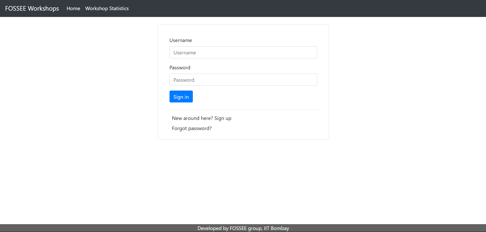
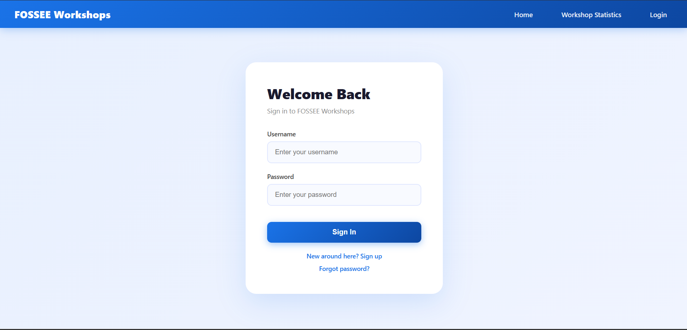
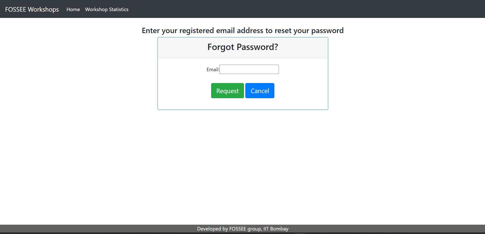
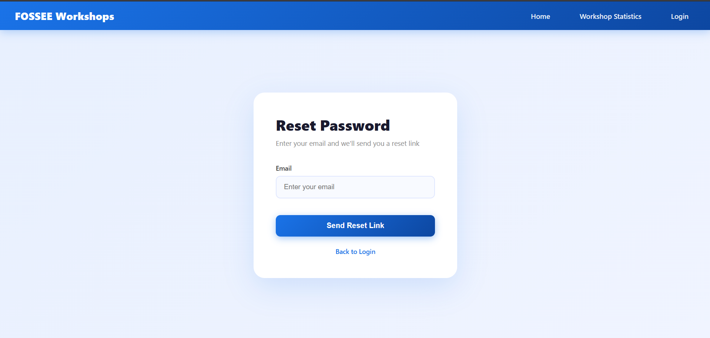
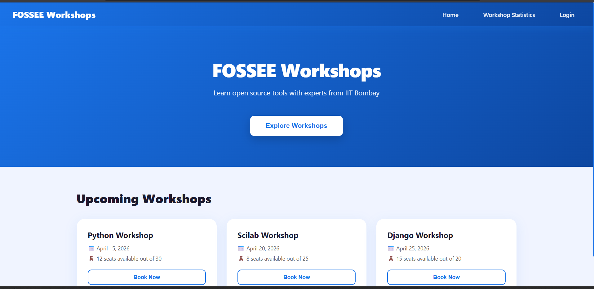
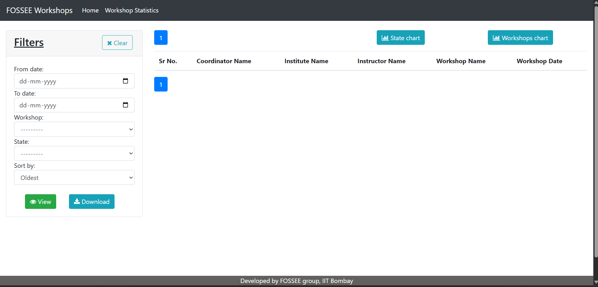
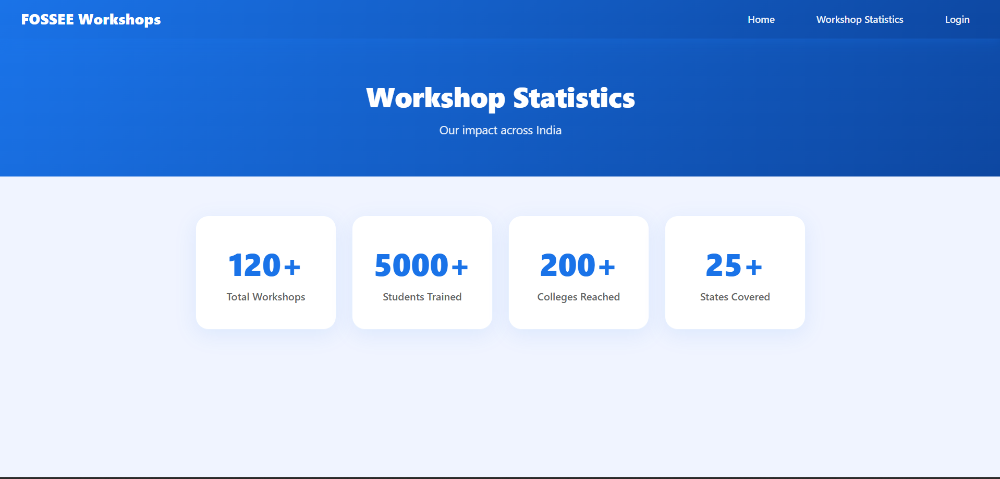
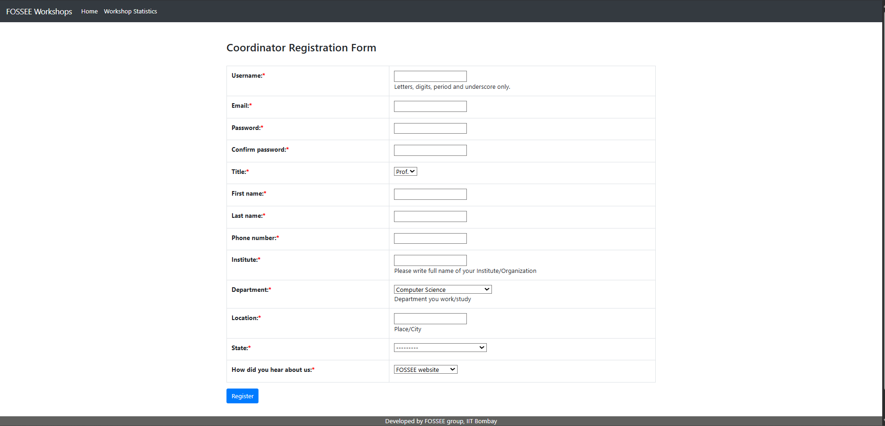
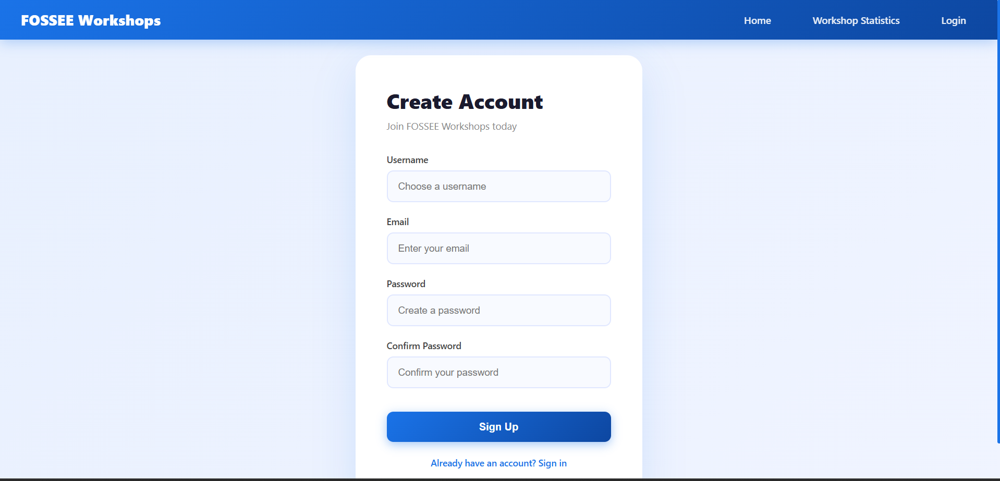

# FOSSEE Workshop Booking - UI/UX Enhancement

## Overview
This project is a redesigned version of the FOSSEE Workshop Booking website built using React. The goal was to improve the UI/UX with a focus on mobile-first design, accessibility, performance, and modern aesthetics.

---

## Before & After Screenshots

### Login Page
**Before:**


**After:**


### Forgot Password Page
**Before:**


**After:**


### Home Page
**Before:**


**After:**


### Statistics Page
**Before:**


**After:**


### Signup Page
**Before:**


**After:**


---

## Setup Instructions

### Prerequisites
- Node.js (v18 or above)
- Python 3.11
- pip

### Backend Setup (Django)
```bash
cd workshop_booking
python -m venv venv
venv\Scripts\activate
pip install -r requirements.txt
python manage.py migrate
python manage.py runserver
```

### Frontend Setup (React)
```bash
cd frontend
npm install
npm start
```

Frontend runs at: http://localhost:3000
Backend runs at: http://127.0.0.1:8000

---

## Design Principles

### 1. Mobile-First Design
The primary users of this platform are students who access it on mobile devices. Every component was designed starting from small screens and scaled up to larger ones using CSS media queries and flexible grid layouts.

### 2. Visual Hierarchy
Clear visual hierarchy was established using font size, weight, and color contrast. Important actions like "Sign In" and "Book Now" are prominently styled with gradient buttons and hover animations to guide users naturally through the interface.

### 3. Consistency
A consistent color palette of blue gradients (#1a73e8 to #0d47a1) was used throughout the app to maintain brand identity and visual coherence across all pages.

### 4. Accessibility
All form inputs have proper labels, sufficient color contrast ratios, and focus states to ensure the site is usable by people with disabilities.

### 5. Performance
React's component-based architecture ensures only necessary parts of the UI re-render. No heavy external libraries were used for styling — pure CSS was preferred to keep the bundle size small.

---

## Responsiveness

Responsiveness was ensured through:
- CSS Flexbox and CSS Grid for fluid layouts
- Media queries at 768px breakpoint for mobile adjustments
- A hamburger menu for mobile navigation
- Fluid typography and padding that scales with screen size
- Cards that stack vertically on small screens using `auto-fit` grid columns

---

## Trade-offs

### Design vs Performance
- Gradient backgrounds and box shadows add visual depth but were kept lightweight using pure CSS instead of images.
- Hover animations use `transform` and `box-shadow` which are GPU-accelerated and do not cause layout reflows, keeping performance smooth.
- No external UI libraries like Material UI or Bootstrap were used to keep bundle size minimal.

---

## Most Challenging Part

The most challenging part was restructuring the Django-based template system into a React single-page application while keeping the core functionality and URL structure recognizable. 

The original site used Django templates tightly coupled with backend views. Rebuilding this in React required carefully mapping each page and its functionality into independent components with React Router handling navigation — all while maintaining the same user flows the original site had.

---

## Tech Stack
- **Frontend:** React, React Router DOM, CSS
- **Backend:** Django 3.0.7, Python 3.11
- **Database:** SQLite

---

## Author
Developed as part of the FOSSEE Python Screening Task